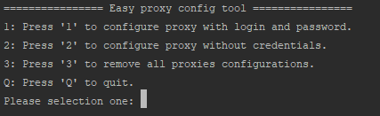
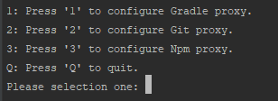

# Easy proxy config tool
A tool made with node to automatically configure the Gradle, Npm and Git proxy.

## How to use
* Install Node.js in your machine.
* Download this repository and unzip it.
* Open the terminal and go to the proxyConfigurationTool folder.
* Run the command: node index.js.
* Navigate through the options.

## Screenshots
Menu 1:

Menu 2:

## Available options
* Proxy configuration for Gradle with/without authentication (you need the gradle installed).
* Proxy configuration for Git with/without authentication (you need the git installed).
* Proxy configuration for NPM with/without authentication (you need the NPM installed).

## Roadmap
* Add HTTPS configurations in the menu options.
* Add proxy support for other technologies.
* Improve the password input security.
* Make more easy to use.

## Contributions
I made this code using only Node.js libraries to avoid installations of external packages. I'm considering that the NPM does't working because it is behind of a proxy. You need keep that in mind to contribute to this project.
* Clone this repository.
* Implement the changes.
* Make a pull request.
